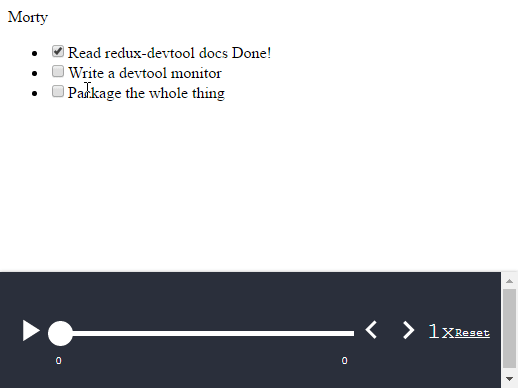

> ***Needs a dist process and npm package. Can be used if you transpile it yourself***

# mobx-redux-devtools
Simple package that allows you to sync [`redux-devtools`](https://github.com/gaearon/redux-devtools)
with [`mobx`](https://github.com/mobxjs/mobx) structure which means you get of all devtool goodness like time-travel (*undo/redo*),
persistence, charts,



## What is `mobx-redux-devtools`?
When using `mobx` you can write your own time-traveling logic like [this example](https://github.com/mobxjs/mobx-reactive2015-demo)
shows. However there are already tools for that purpose in [`redux`](https://github.com/reactjs/redux) which include a
rich and well-developed ecosystem of additional maintained packages built around it.
Saving you some work and keeping things DRY, `mobx-redux-devtools` makes it possible to use those
handy `redux` packages.

In `redux` terms this package contains just 2 containers of `React` components - [`MobxMonitor`](./src/monitor.js)
and [a wrapper](./src/devtools.js) around `createDevTools()` from `react-devtools`.

## Installation
Not yet on npm so:
```
npm install antitoxic/mobx-redux-devtools
```

## Usage
> If you are not familiar with `redux-devtools`.,
> [read through the official walkthrough](https://github.com/gaearon/redux-devtools/blob/master/docs/Walkthrough.md) first.

You need to write [serializer and deserializer](#serializing) and just [render the `DevTools`](#render)
in which you nest the `redux-devtools` monitors that you prefer.

### Example
```js
import {Component, PropTypes} from 'react';
import ReactDOM from 'react-dom';
import {observable, createTransformer} from "mobx";
import {observer} from "mobx-react";
import DockMonitor from 'redux-devtools-dock-monitor';
import LogMonitor from 'redux-devtools-log-monitor';
import SliderMonitor from 'redux-slider-monitor';
import {DevTools} from 'mobx-redux-devtools';

class Todo {
    id;
    @observable title = '';
    @observable done = false;

    constructor(title, done, id) {
        this.title = title;
        this.done = done;
        this.id = id;
    }
}

class AppStore {
    @observable assignee = 'Morty';
    @observable todos = [
        new Todo("Read redux-devtool docs", true, 1),
        new Todo("Write a devtool monitor", false, 2),
        new Todo("Package the whole thing", false, 3),
    ];
}

const serializeState = createTransformer(store => ({
    assignee: store.baba,
    todos: store.todos.map(serializeTodo),
}));

const serializeTodo = createTransformer(todo => ({
    title: todo.title,
    done: todo.done,
    id: todo.id
}));

function deserializeState(store, data) {
    store.todos = data.todos.map(todo => new Todo(todo.title, todo.done, todo.id));
    store.assignee = data.baba
}

function tickTodo(todo) {
    todo.done = !todo.done
}

@observer
class TodoListView extends Component {
    render() {
        return <div>
            {this.props.todoList.assignee}
            <ul>
                {this.props.todoList.todos.map(todo =>
                    <TodoView todo={todo} key={todo.id} clickHandler={tickTodo}/>
                ) }
            </ul>
            <DevTools serialize={serializeState} hydrate={deserializeState} observable={store}>
                <DockMonitor toggleVisibilityKey='ctrl-h'
                             changePositionKey='ctrl-q'
                             changeMonitorKey='ctrl-m'
                             defaultPosition="bottom"
                             defaultIsVisible={true}>
                    <SliderMonitor/>
                    <LogMonitor theme='tomorrow'/>
                </DockMonitor>
            </DevTools>
        </div>
    }
}

@observer
class TodoView extends Component {
    render() {
        const {todo, clickHandler} = this.props;
        return <li className={"tree"} >
            <input
                type="checkbox"
                checked={todo.done}
                onClick={() => clickHandler(todo) }
            />{todo.title} <If condition={todo.done}>Done!</If>
        </li>
    }
}


var store = new AppStore();
ReactDOM.render(
    <TodoListView todoList={store}/>,
    document.getElementById('react')
);
```

And there you go. Now you have optimized PureRendering components observed by mobx and
tracked by redux devtools.

<a name="serializing"></a>
### Writing serializer and deserializer
Mobx observables (stores) are not plain objects. Often, if you have medium-sized app, they
are actually represented by a graph. In order to persist the graph you need
to write a serializer and deserializer. Note that you most likely need
serializer/deserializer anyway for things like server side rendering or session persistence.

In addition the example above, here's [another one ](https://mobxjs.github.io/mobx/best/store.html)
showcasing example of a mobx structure that hydrates from json.

<a name="render"></a>
### Render DevTools`
To render the devtools you need to place the provided `DevTools` component in your component tree and nest the
redux monitors you want to use as its chilren. This is what the example above is doing.

#### Properties

##### `observable`
Required. This is the mobx observable object you want to manage with the devtools

##### `serialize: function(mobxObervable): plainobject`
Required. Function that accepts the mobx observable and returns a plain object.

##### `hydrate: function(mobxObservable, plainObject)`
Required. Function that accepts the mobx observable plus a plain object and updates the observable.

##### `enhancers: Array`
List of redux store enhancers (*i.e. `persistState`*).

#### Already using redux?
If you already use redux and you only want the `MobxMonitor` wrap all of your
other monitors in it. See the source code for details. It's very straightforward.